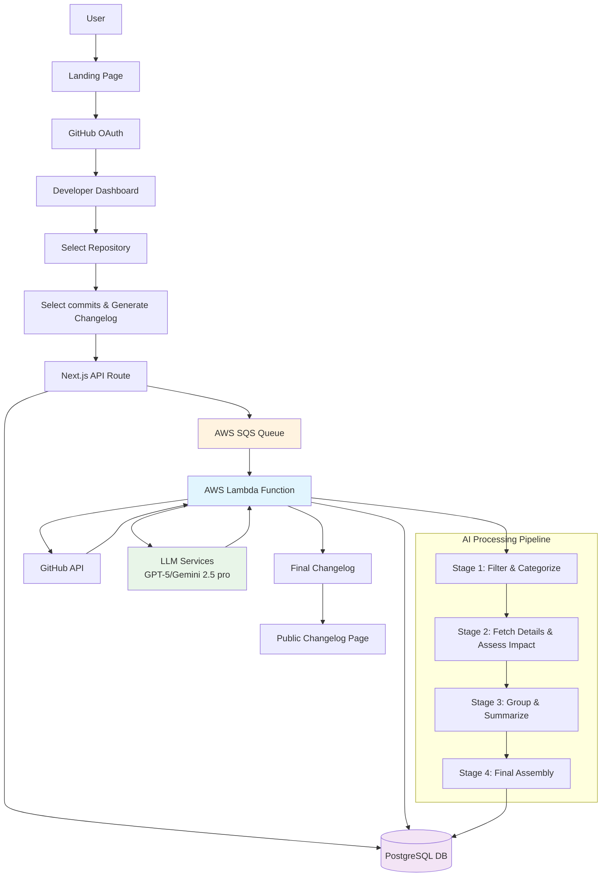
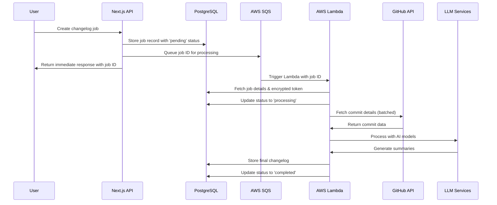

# Greptile assignment: Logtiles - AI-Powered Changelog Generator

Logtiles is an AI-powered tool that transforms commit history into clean, readable release notes in minutes
#### Try at: https://logtile.vercel.app/

## Architecture & Technical Decisions

### Tech Stack
- Frontend: Next.js, React, TypeScript, Tailwind, NextUI, Shadcn UI.
- Backend: Node, PostgreSQL, LLM (GPT-5/Gemini 2.5 pro), AWS SQS, AWS Lambda
- DevOps: Vercel, AWS, NeonDB

### System Architecture Overview


#### Queue-Based Processing Architecture
The backend uses **AWS SQS (Simple Queue Service)** for reliable, asynchronous processing of time-intensive changelog generation:

**Why SQS + Lambda?**
- **Scalability**: Handle multiple concurrent users without blocking the web application as ChangeLog creation can take some of time to process
- **Reliability**: Queue ensures jobs aren't lost if processing fails
- **Decoupling**: Frontend can immediately respond while heavy processing happens in background

**Processing Flow:**


#### Multi-Stage AI Pipeline
We have LLM based changelog generation process consists of four distinct stages within the Lambda function:

1. **Stage 1: Filter and Categorize**
   - Fetches basic commit information from GitHub GraphQL API
   - Categorizes commits using conventional commit patterns (feat, fix, breaking, etc.)
   - Filters out non-user-facing changes (docs, tests, chore)

2. **Stage 2: Fetch Details and Assess Impact**
   - Retrieves detailed commit information including file changes
   - Assesses user-facing impact of each change using LLMs
   - Identifies breaking changes and security updates

3. **Stage 3: Group and Summarize**
   - Groups changes into logical categories
   - Generates executive summary using LLM
   - Creates structured changelog sections

4. **Stage 4: Final Assembly**
   - Formats output as clean markdown
   - Adds metadata (version, contributors, date range)
   - Generates public-friendly titles and descriptions

#### Database Design
- **PostgreSQL** with optimized schema for changelog jobs and outputs
- **JSON storage** for complex AI processing results
- **Encrypted tokens** for secure GitHub API access
- **Comprehensive logging** for debugging and monitoring

#### External Integrations
- **GitHub API**: GraphQL for efficient commit data fetching
- **LLM Services**: OpenAI and Google AI for LLMs like GPT-5, Gemini 2.5 Pro as they are considered state of the art with reasonable cost per tokens
- **AWS Services**: SQS for queuing, Lambda for processing, potential CloudWatch for monitoring


## Ideal User Flow

1. **Landing page**: Marketing page explaining the value proposition
2. **Authentication**: GitHub OAuth for repository access
3. **Repository management**: Connect and manage GitHub repositories
4. **Changelog generation**:
   - Select repository and date range
   - Select commits required for Changelog generation and submit
   - Monitor real-time progress
   - Review and edit generated changelog
5. **Public sharing**: Share formatted changelogs with end users


## Future Enhancements

While this is a complete, working solution, potential improvements include:
- **Template system**: Customizable changelog formats
- **Custom Domains**: Custom Domains for User facing Changelog pages for better brand visiblity of users
- **Team collaboration**: Multi-user editing and review workflows
- **Integration APIs**: Webhooks for automated changelog generation
- **Advanced filtering**: More granular control over included content


## Getting Started

### Prerequisites
- Node.js 18+
- PostgreSQL database
- GitHub OAuth app (for authentication)
- AWS account (for Lambda deployment - optional for development)

### Installation

1. **Clone and install dependencies**
```bash
git clone <repository-url>
cd logtiles
npm install
```

2. **Environment setup**
```bash
cp .env.example .env.local
# Configure your database, GitHub OAuth, and other services
```

3. **Database setup**
Set up the required database tables for authentication and product functionality.

4. **Start development server**
```bash
npm run dev
```

5. **Access the application**
- Open http://localhost:3000
- Sign in with GitHub
- Connect a repository
- Generate your first changelog


---

