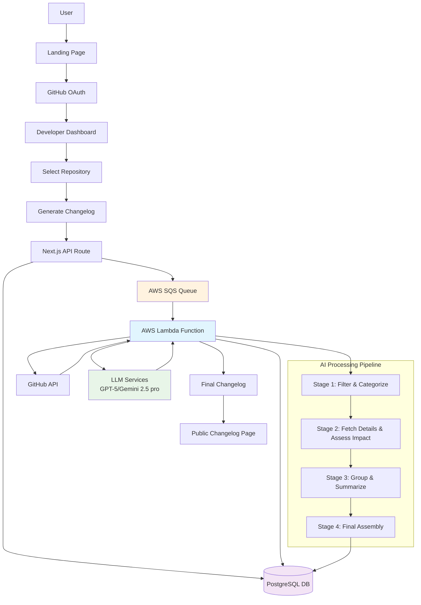
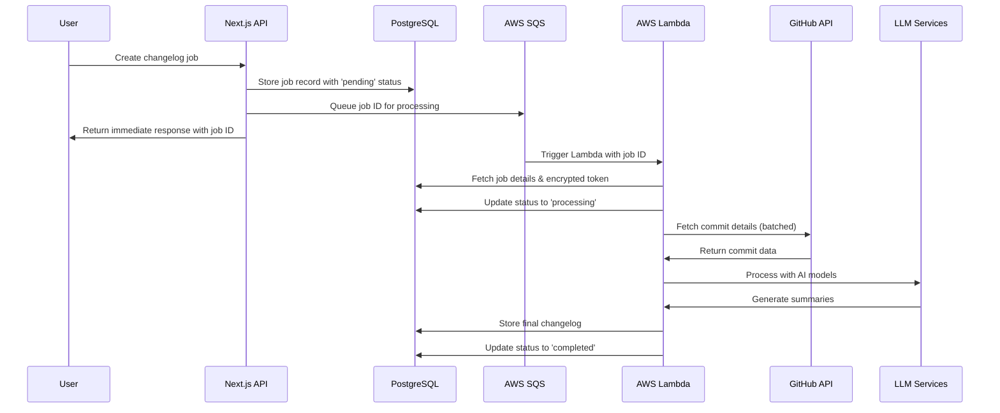

# Logtiles - AI-Powered Changelog Generator

Logtiles is an AI-powered tool that transforms commit history into clean, readable release notes. Built as a take-home interview project, it demonstrates the principles of building developer tools with user-centered design and robust technical architecture.

## Problem Solved

Developers maintaining developer tools frequently face challenges when writing changelogs:

1. **Time-consuming**: Reviewing days of commits to identify changes
2. **Inconsistent**: Summarizing changes in a way that is relevant to end users
3. **Repetitive**: Performing this process manually for every release

Logtiles uses large language models to automate this process while maintaining the clarity that makes changelogs useful.

## Key Features

### Developer Experience
- **GitHub-native**: Connect repositories and generate changelogs directly from commits, PRs, and tags
- **Smart filtering**: Automatically identifies user-facing changes while filtering out noise
- **Real-time processing**: Monitor changelog generation with live progress updates
- **Flexible date ranges**: Generate changelogs for any time period or commit range

### Public Display
- **Clean, readable format**: Minimal, theme-aware design that works in light and dark modes
- **SEO-optimized**: Proper metadata and structure for search engines
- **Mobile-friendly**: Responsive design that works on all devices

### Technical Highlights
- **Multi-stage AI pipeline**: Sophisticated processing from raw commits to polished output
- **Scalable architecture**: AWS Lambda for AI processing, PostgreSQL for data persistence
- **Real-time updates**: Live progress tracking for job status
- **Type-safe**: Full TypeScript implementation with comprehensive error handling

## Architecture & Technical Decisions

### System Architecture Overview


### Frontend (Next.js 15 + React 18)
- **Modern React patterns**: Server and client components, proper loading states, optimistic updates
- **Clean UI**: HeroUI components with Tailwind CSS for consistent, accessible design
- **Theme support**: Dark and light mode with proper contrast ratios
- **Performance**: Optimized bundle size, proper caching strategies

### Backend & AI Processing

#### Queue-Based Processing Architecture
The backend uses **AWS SQS (Simple Queue Service)** for reliable, asynchronous processing of time-intensive changelog generation:

**Why SQS + Lambda?**
- **Scalability**: Handle multiple concurrent users without blocking the web application
- **Reliability**: Queue ensures jobs aren't lost if processing fails
- **Cost efficiency**: Pay only for actual processing time
- **Decoupling**: Frontend can immediately respond while heavy processing happens in background

**Processing Flow:**


#### Multi-Stage AI Pipeline
The changelog generation process consists of four distinct stages within the Lambda function:

1. **Stage 1: Filter and Categorize**
   - Fetches basic commit information from GitHub GraphQL API
   - Categorizes commits using conventional commit patterns (feat, fix, breaking, etc.)
   - Filters out non-user-facing changes (docs, tests, chore)

2. **Stage 2: Fetch Details and Assess Impact**
   - Retrieves detailed commit information including file changes
   - Assesses user-facing impact of each change
   - Identifies breaking changes and security updates

3. **Stage 3: Group and Summarize**
   - Groups changes into logical categories
   - Generates executive summary using LLM
   - Creates structured changelog sections

4. **Stage 4: Final Assembly**
   - Formats output as clean markdown
   - Adds metadata (version, contributors, date range)
   - Generates public-friendly titles and descriptions

#### Database Design
- **PostgreSQL** with optimized schema for changelog jobs and outputs
- **JSON storage** for complex AI processing results
- **Encrypted tokens** for secure GitHub API access
- **Comprehensive logging** for debugging and monitoring

#### External Integrations
- **GitHub API**: GraphQL for efficient commit data fetching
- **LLM Services**: OpenAI and Google AI for natural language processing
- **AWS Services**: SQS for queuing, Lambda for processing, potential CloudWatch for monitoring

### Product Decisions

**User-Centered Design Philosophy**
- **Minimal cognitive load**: Clean interface that guides users through the process
- **Progressive disclosure**: Advanced options are hidden by default
- **Immediate feedback**: Real-time status updates during processing
- **Error recovery**: Clear error messages with actionable next steps

**Developer Experience Focus**
- **GitHub OAuth**: Simple authentication that integrates seamlessly
- **Contextual actions**: Quick access to common workflows from the dashboard
- **Visual progress**: Clear indication of current processing status
- **Copy-friendly output**: Markdown format ready for release notes

**Performance and Scalability**
- **Asynchronous processing**: Heavy AI work occurs in background Lambda functions
- **Efficient caching**: Proper HTTP caching headers and database query optimization
- **Batch processing**: Smart batching of API calls to respect rate limits
- **Resource management**: Cleanup of temporary data and proper error handling

## Getting Started

### Prerequisites
- Node.js 18+
- PostgreSQL database
- GitHub OAuth app (for authentication)
- AWS account (for Lambda deployment - optional for development)

### Installation

1. **Clone and install dependencies**
```bash
git clone <repository-url>
cd logtiles
npm install
```

2. **Environment setup**
```bash
cp .env.example .env.local
# Configure your database, GitHub OAuth, and other services
```

3. **Database setup**
Set up the required database tables for authentication and product functionality.

4. **Start development server**
```bash
npm run dev
```

5. **Access the application**
- Open http://localhost:3000
- Sign in with GitHub
- Connect a repository
- Generate your first changelog

## User Flow

1. **Landing page**: Marketing page explaining the value proposition
2. **Authentication**: GitHub OAuth for repository access
3. **Repository management**: Connect and manage GitHub repositories
4. **Changelog generation**:
   - Select repository and date range
   - Configure generation options
   - Monitor real-time progress
   - Review and edit generated changelog
5. **Public sharing**: Share formatted changelogs with end users

## Design Philosophy

**Simple by Default**
- Clean, uncluttered interface
- Progressive disclosure of advanced features
- Consistent visual hierarchy

**Developer-First**
- Efficient workflows and keyboard shortcuts
- Clear status indicators and progress tracking
- Contextual help and error messages

**Accessible and Inclusive**
- WCAG-compliant color contrast
- Keyboard navigation support
- Screen reader compatibility

## Development Notes

This project demonstrates key principles for building developer tools:

- **API-first design**: Clean separation between UI and business logic
- **Error boundaries**: Graceful degradation when issues occur
- **Performance monitoring**: Built-in logging and analytics
- **Scalable architecture**: Designed to handle growth from day one

## Future Enhancements

While this is a complete, working solution, potential improvements include:
- **Template system**: Customizable changelog formats
- **Team collaboration**: Multi-user editing and review workflows
- **Integration APIs**: Webhooks for automated changelog generation
- **Advanced filtering**: More granular control over included content

## Evaluation Criteria Addressed

- **Works**: Fully functional end-to-end changelog generation
- **Backend logic**: Sophisticated multi-stage AI pipeline with proper error handling
- **User-centered design**: Intuitive developer experience with clear visual feedback
- **Clean design**: Minimal, professional appearance
- **Developer UX**: Streamlined workflow that saves significant time versus manual processes

---

Built as a take-home interview project. Demonstrates the intersection of technical excellence, product intuition, and user-centered design in developer tooling.
